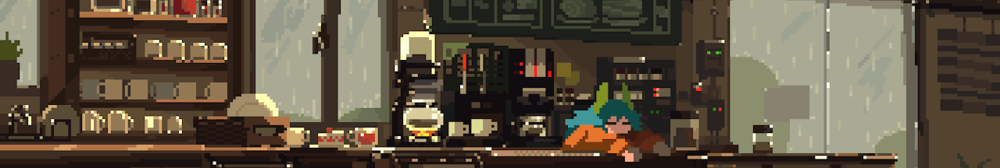

<h1 align="center">Hiiii! 👋</h1>
<h3 align="center">I'm currently a computer science student</h3>

 

<h2 align="left">🛠 Tools I Use</h2>

<!-- 🔵 Blue-Themed Badges -->

<!-- 🟣 Purple-Themed Badges -->

<!-- 🟢 Green-Themed Badges -->

<!-- 🔴 Red-Themed Badges -->

<!-- 🟠 Orange-Themed Badges -->

  <h2>🐍 Contributions</h2>
  <picture>
    <source media="(prefers-color-scheme: dark)" srcset="https://raw.githubusercontent.com/Aron-Arboleda/Aron-Arboleda/output/github-contribution-grid-snake-dark.svg" />
    <source media="(prefers-color-scheme: light)" srcset="https://raw.githubusercontent.com/Aron-Arboleda/Aron-Arboleda/output/github-contribution-grid-snake.svg" />
    
  </picture>
   

<!-- <h2 align="left">⚡ Stats</h2>
 

  <picture>
    <source media="(prefers-color-scheme: dark)" srcset="https://github-readme-stats.vercel.app/api?username=aron-arboleda&show_icons=true&locale=en&border_radius=10&rank_icon=github&theme=github_dark" />
    <source media="(prefers-color-scheme: light)" srcset="https://github-readme-stats.vercel.app/api?username=aron-arboleda&show_icons=true&locale=en&border_radius=10&rank_icon=github" />
    
  </picture>
  <picture>
    <source media="(prefers-color-scheme: dark)" srcset="https://github-readme-streak-stats.herokuapp.com/?user=aron-arboleda&border_radius=10&theme=github_dark_blue" />
    <source media="(prefers-color-scheme: light)" srcset="https://github-readme-streak-stats.herokuapp.com/?user=aron-arboleda&border_radius=10" />
    
  </picture>
  <picture>
    <source media="(prefers-color-scheme: dark)" srcset="https://github-readme-stats.vercel.app/api/top-langs?username=aron-arboleda&show_icons=true&langs_count=8&locale=en&layout=compact&border_radius=10&exclude_repo=github-readme-stats&theme=github_dark" />
    <source media="(prefers-color-scheme: light)" srcset="https://github-readme-stats.vercel.app/api/top-langs?username=aron-arboleda&show_icons=true&langs_count=8&locale=en&layout=compact&border_radius=10&exclude_repo=github-readme-stats" />
    
  </picture>

 -->
 
<h2 align="left">🏠 Socials</h2>

 
  
  
  
  
  

<h3>Credits</h3>

- Readme <a href="https://www.youtube.com/watch?v=eHaXw8Bd_ms&t=631s" target="_blank" rel="noreferrer">Guide</a> & <a href="https://rahuldkjain.github.io/gh-profile-readme-generator" target="_blank" rel="noreferrer">Design Generator</a>.

- <a href="https://www.patreon.com/posts/something-gif-19601461?epik=dj0yJnU9YlMyV0JJOExYQ0Y1ajBEUDdfV1pYQkRuVTl6UGxGQWEmcD0wJm49RzlwbUJYLXI5ZTVVZHJCRHRvRm9wdyZ0PUFBQUFBR1dObFYw" target="_blank" rel="noreferrer">Banner Image</a>
